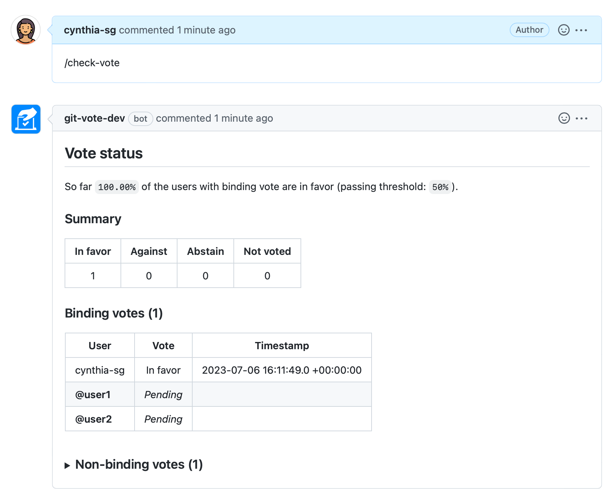

# GitVote

**GitVote** is a GitHub application that allows holding a vote on *issues* and *pull requests*.

## Usage

The first step is to install the [GitVote GitHub application](https://github.com/apps/git-vote) in the organization or repositories you'd like. Alternatively, you can deploy your own instance of the GitVote service by using [the Helm chart provided](https://artifacthub.io/packages/helm/gitvote/gitvote) (some organizations may prefer this option for private repositories).

Once the application has been installed we can proceed with its configuration.

### Configuration

To create votes, you'll first need to add a [.gitvote.yml](https://github.com/cncf/gitvote/blob/main/docs/config/.gitvote.yml) configuration file. GitVote will look for it in the following locations (in order of precedence):

- At the root of the repository where the vote was created
- At the root of the `.github` repository, for organization wide configuration

Please note that the configuration file is **required** and no commands will be processed if it cannot be found. Once a vote is created, the configuration it will use during its lifetime will be the one present at the vote creation time.

For more information about the configuration file format please see the [reference documentation](https://github.com/cncf/gitvote/blob/main/docs/config/.gitvote.yml).

### Creating votes

Votes can be created by calling the `/vote` command on an *issue* or *pull request*. This can be done by:

- adding the **/vote** command to the *issue* or *pull request* body at creation time
- adding a new comment to an existing *issue* or *pull request* with the **/vote** command in it

The command **must** be on a line by itself. Please note that GitVote only detects commands in issues or pull requests bodies when they are opened, or when comments are created, *not when any of them are edited*.

Alternatively, if you have setup multiple configuration profiles, you can also start votes using any of them with the command `/vote-PROFILE`.

Only repositories collaborators can create votes. For organization-owned repositories, the list of collaborators includes outside collaborators, organization members that are direct collaborators, organization members with access through team memberships, organization members with access through default organization permissions, and organization owners.

Shortly after the comment with the `/vote` command is posted, the vote will be created and the bot will post a new comment to the corresponding issue or pull request with the vote instructions.

#### Automation

GitVote allows votes to be created automatically on pull requests when any of the files affected matches certain predefined patterns. For more information about how to set it up, please see the automation section in the [reference documentation](https://github.com/cncf/gitvote/blob/main/docs/config/.gitvote.yml).

### Voting

Users can cast their votes by reacting to the `git-vote` bot comment where the vote was created (screenshot above).

It is possible to vote `in favor`, `against` or to `abstain`, and each of these options can be selected with the following reactions:

| In favor | Against | Abstain |
| :------: | :-----: | :-----: |
|    👍     |    👎    |    👀    |

Only votes from users with a binding vote as defined in the configuration file will be counted.

*Please note that voting multiple options is not allowed and those votes won't be counted.*

### Checking votes

It is possible to check the status of a vote in progress by calling the `/check-vote` command:

*Please note that this command can only be called once a day per vote (additional calls will be ignored).*

### Closing votes

Once the vote time is up, the vote will be automatically closed and the results will be published in a new comment.

### Cancelling votes

It is possible to cancel a vote in progress by calling the `/cancel-vote` command:

### Checks in pull requests (experimental)

When a vote on a pull request is closed, GitVote will add a check to the head commit with its result. If the vote passes, the result of the check will be *success*, whereas if it doesn't pass, it'll be *failure*. When used in combination with `protected branch`, this feature can be used to *require* a vote in favor before a pull request can be merged.

At the moment this feature is always enabled but we'll make it configurable so that votes creators can opt-out per configuration profile.

## Adopters

Please see [ADOPTERS.md](./ADOPTERS.md) for more details.

## Contributing

Please see [CONTRIBUTING.md](./CONTRIBUTING.md) for more details.

## Code of Conduct

This project follows the [CNCF Code of Conduct](https://github.com/cncf/foundation/blob/master/code-of-conduct.md).

## License

GitVote is an Open Source project licensed under the [Apache License 2.0](https://www.apache.org/licenses/LICENSE-2.0).
